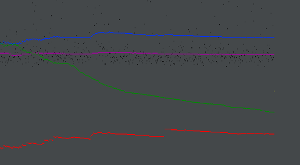
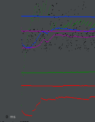

- # General
  - #### Team#: GLHF

  - #### Names: Joshua J Yoo

  - #### Project 5 Video Demo Link: [pj5]([https://www.youtube.com/@jjy0410](https://youtu.be/yGIK5BOVGs4)

  - #### Instruction of deployment:
Ensure you've populated your 'moviedb' database with the movie-data.sql file if you haven't already.

For development on IntelliJ with Tomcat Configuration, simply run the program.

For production, execute the `mvn package` command where the pom.xml file is located to compile the Java code. Move the generated .war file to the tomcat/webapps directory.

Run the password encryption script UpdateSecurePassword. Set iWantToEncrypt to true and choose either customers or employees as the database, depending on the one you want to encrypt. Note that only CSS, JS, Java, and HTML are used, and no additional technologies are employed beyond these.
    

- # Connection Pooling
  - #### Include the filename/path of all code/configuration files in GitHub of using JDBC Connection Pooling.
Resources defind in: WebContent/META-INF/context.xml. All connection are made in src/
  - #### Explain how Connection Pooling is utilized in the Fabflix code.
All connections are established through static methods defined in /src/MyUtils.java. For read operations, we use MyUtils.getReadConnection(), which establishes a connection using the moviedb_read resource. Similarly, for write operations, MyUtils.getWriteConnection() is invoked, creating a connection using the moviedb_write resource. In both cases, an Environment Context is created to form a DataSource, from which a connection is obtained and then returned.
  - #### Explain how Connection Pooling works with two backend SQL.
Read operations utilize a connection pool from the local MySQL, while write operations are initiated with a connection pool from the master MySQL. This ensures optimized and efficient management of connections for respective read and write activities.

- # Master/Slave
  - #### Include the filename/path of all code/configuration files in GitHub of routing queries to Master/Slave SQL.
**1. Read and Write resources defined in:**
- **Location:** `/WebContent/META-INF/context.xml`
- **Write Resource:** moviedb_write
- **Read Resource:** moviedb_read

**2. All connections made in:**
- **Location:** `/src/MyUtils.java`
- **Reads:** Invoked by `MyUtils.getReadConnection()` using the moviedb_read resource
- **Writes:** Invoked by `MyUtils.getWriteConnection()` using the moviedb_write resource
  - #### How read/write requests were routed to Master/Slave SQL?
### 1. moviedb_read:
- **Connection Details:**
  - User: mytestuser
  - Connection: localhost
- **Functionality:**
  - Establishes a connection to the backend MYSQL on the instance utilizing this resource.

### 2. moviedb_write:
- **Connection Details:**
  - User: fabflix-master
  - Connection: master-instance
- **Functionality:**
  - Connects to the backend MYSQL of the master instance, regardless of the instance using this resource.
  - Ensures all write operations are consistently propagated to the master instance's backend MYSQL.
  - Restricts write operations to the master instance, maintaining data integrity.
  
- # JMeter TS/TJ Time Logs
  - #### Instructions of how to use the `log_processing.*` script to process the JMeter logs.
The `log_processing.py` script, located at the root of our project, is designed to be executed via the command line. To use it, run the following command:

python log_processing.py <pathtofile>

- # JMeter TS/TJ Time Measurement Report

| **Single-instance Version Test Plan**          | **Graph Results Screenshot** | **Average Query Time(ms)** | **Average Search Servlet Time(ms)** | **Average JDBC Time(ms)** | **Analysis** |
|------------------------------------------------|------------------------|----------------------------|-------------------------------------|---------------------------|--------------|
| Case 1: HTTP/1 thread                          |  | 231                        | 6.325                                  |      3.414                |         |
| Case 2: HTTP/10 threads                        |  | 312                        | 5.751                                  |         3.107             |         |
| Case 3: HTTPS/10 threads                       |  | 540                        | 6.331                                   |         3.731            |         |
| Case 4: HTTP/10 threads/No connection pooling  |  | 331                        | 51.220                                  |         5.851            |         |

| **Scaled Version Test Plan**                   | **Graph Results Screenshot** | **Average Query Time(ms)** | **Average Search Servlet Time(ms)** | **Average JDBC Time(ms)** | **Analysis** |
|------------------------------------------------|------------------------------|----------------------------|-------------------------------------|---------------------------|--------|
| Case 1: HTTP/1 thread                          |    | 227                        | 3.225                               | 1.776                     |        |
| Case 2: HTTP/10 threads                        |    | 287                        | 3.641                               | 2.017                     |        |
| Case 3: HTTP/10 threads/No connection pooling  |    | 324                        | 37.512                              | 5.195                     |        |
